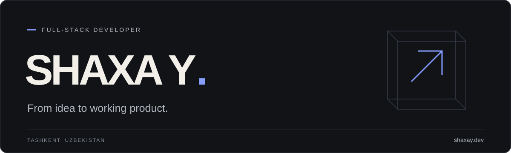

I'm **Shakhzod**, a full-stack developer based in Tashkent.
I build websites, web apps, and the systems behind them — from the first sketch to launch.

I care about clear interfaces, thoughtful details, and software that makes everyday work easier.

[Portfolio](https://shaxay.dev/en) · [Telegram](https://t.me/shaxay) · [Email](mailto:hello@shaxay.dev)

### Selected work

| Project | What I built |
| :--- | :--- |
| [**House of Co**](https://shaxay.dev/en/projects/house-of-co) | A multilingual coliving platform with listings, availability, bookings, and online payments. |
| [**Dynamo Soccer Academy**](https://shaxay.dev/en/projects/dynamo) | An academy website with programs, schedules, applications, and a dedicated admin panel. |
| [**borili**](https://shaxay.dev/en/projects/borili) | A local platform for discovering events and places, creating meetups, and building clubs. |

### Tools I work with

**TypeScript · React · Next.js · Node.js · PostgreSQL · Cloudflare**

### On GitHub

Most of my client work lives in private repositories. Public case studies are on my [portfolio](https://shaxay.dev/en#projects).

[**Terminal portfolio**](https://github.com/shaxaydev/shaxay) — an interface experiment with a command palette, themes, and English / Russian support.
